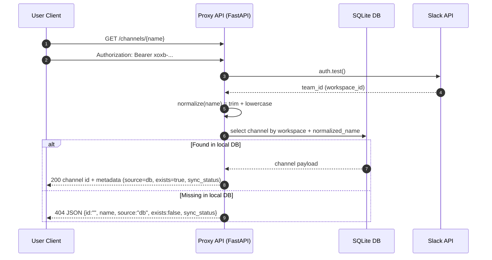
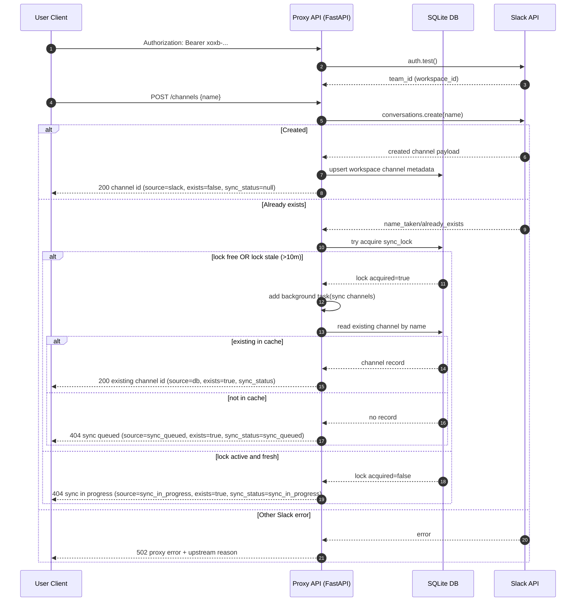
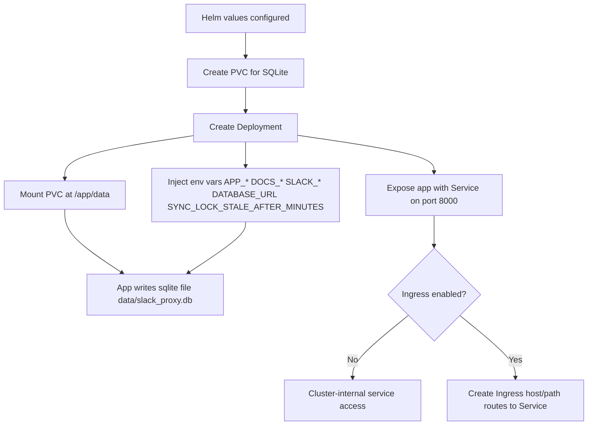
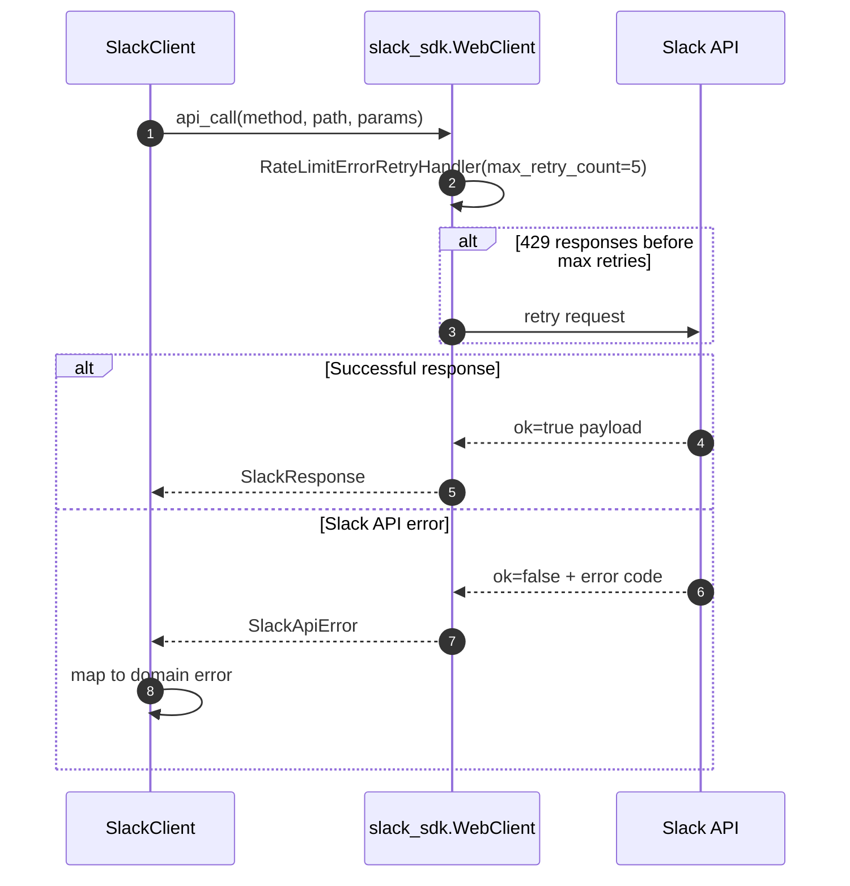
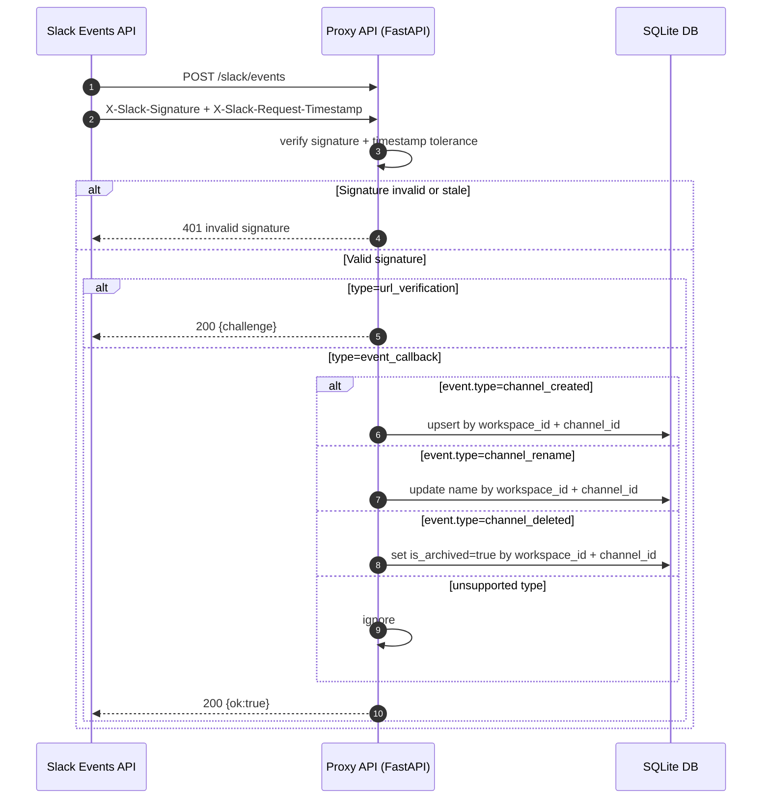

# Slack Proxy Interaction Flow

## Read Channel by Name

```mermaid
sequenceDiagram
  autonumber
  participant U as User Client
  participant P as Proxy API (FastAPI)
  participant D as SQLite DB
  participant S as Slack API

  U->>P: GET /channels/{name}
  U->>P: Authorization: Bearer xoxb-...
  P->>S: auth.test()
  S-->>P: team_id (workspace_id)
  P->>P: normalize(name) = trim + lowercase
  P->>D: select channel by workspace + normalized_name
  alt Found in local DB
    D-->>P: channel payload
    P-->>U: 200 channel id + metadata (source=db, exists=true, sync_status)
  else Missing in local DB
    P-->>U: 404 JSON {id:"", name, source:"db", exists:false, sync_status}
  end
```

## Create Channel by Name

```mermaid
sequenceDiagram
  autonumber
  participant U as User Client
  participant P as Proxy API (FastAPI)
  participant D as SQLite DB
  participant S as Slack API

  U->>P: Authorization: Bearer xoxb-...
  P->>S: auth.test()
  S-->>P: team_id (workspace_id)
  U->>P: POST /channels {name}
  P->>S: conversations.create(name)
  alt Created
    S-->>P: created channel payload
    P->>D: upsert workspace channel metadata
    P-->>U: 200 channel id (source=slack, exists=false, sync_status=null)
  else Already exists
    S-->>P: name_taken/already_exists
    P->>D: try acquire sync_lock
    alt lock free OR lock stale (>10m)
      D-->>P: lock acquired=true
      P->>P: add background task(sync channels)
      P->>D: read existing channel by name
      alt existing in cache
        D-->>P: channel record
        P-->>U: 200 existing channel id (source=db, exists=true, sync_status)
      else not in cache
        D-->>P: no record
        P-->>U: 404 sync queued (source=sync_queued, exists=true, sync_status=sync_queued)
      end
    else lock active and fresh
      D-->>P: lock acquired=false
      P-->>U: 404 sync in progress (source=sync_in_progress, exists=true, sync_status=sync_in_progress)
    end
  else Other Slack error
    S-->>P: error
    P-->>U: 502 proxy error + upstream reason
  end
```

## Helm Deployment Flow

```mermaid
flowchart TD
  A[Helm values configured] --> B[Create PVC for SQLite]
  B --> C[Create Deployment]
  C --> D[Mount PVC at /app/data]
  C --> E[Inject env vars APP_* DOCS_* SLACK_* DATABASE_URL SYNC_LOCK_STALE_AFTER_MINUTES]
  D --> F[App writes sqlite file data/slack_proxy.db]
  E --> F
  C --> G[Expose app with Service on port 8000]
  G --> H{Ingress enabled?}
  H -->|No| I[Cluster-internal service access]
  H -->|Yes| J[Create Ingress host/path routes to Service]
```

## Slack SDK Request Flow

```mermaid
sequenceDiagram
  autonumber
  participant C as SlackClient
  participant W as slack_sdk.WebClient
  participant S as Slack API

  C->>W: api_call(method, path, params)
  W->>W: RateLimitErrorRetryHandler(max_retry_count=5)
  alt 429 responses before max retries
    W->>S: retry request
  end
  alt Successful response
    S-->>W: ok=true payload
    W-->>C: SlackResponse
  else Slack API error
    S-->>W: ok=false + error code
    W-->>C: SlackApiError
    C->>C: map to domain error
  end
```

## Slack Events Subscription Flow

```mermaid
sequenceDiagram
  autonumber
  participant S as Slack Events API
  participant P as Proxy API (FastAPI)
  participant D as SQLite DB

  S->>P: POST /slack/events
  S->>P: X-Slack-Signature + X-Slack-Request-Timestamp
  P->>P: verify signature + timestamp tolerance
  alt Signature invalid or stale
    P-->>S: 401 invalid signature
  else Valid signature
    alt type=url_verification
      P-->>S: 200 {challenge}
    else type=event_callback
      alt event.type=channel_created
        P->>D: upsert by workspace_id + channel_id
      else event.type=channel_rename
        P->>D: update name by workspace_id + channel_id
      else event.type=channel_deleted
        P->>D: set is_archived=true by workspace_id + channel_id
      else unsupported type
        P->>P: ignore
      end
      P-->>S: 200 {ok:true}
    end
  end
```
